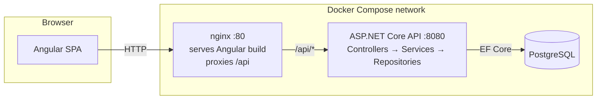

# TaskFlow — Task & Project Management

A full-stack task and project management app built as a learning/portfolio project, demonstrating a
production-shaped architecture end to end: Angular frontend, ASP.NET Core Web API backend, PostgreSQL,
JWT auth, Docker Compose, and CI.

Users can register, log in, create projects, add tasks to them, and track task status on a drag-and-drop
kanban board. Each user only sees and manages their own data.

## Tech stack

| Layer          | Technology |
|----------------|------------|
| Frontend       | Angular 22 (standalone components), Tailwind CSS, RxJS, Angular CDK (drag-drop) |
| Backend        | ASP.NET Core 8 Web API, C#, EF Core (code-first migrations) |
| Database       | PostgreSQL 16 |
| Auth           | JWT access + refresh tokens, BCrypt password hashing |
| Containerization | Docker + Docker Compose |
| CI/CD          | GitHub Actions (separate backend/frontend workflows) |

## Repository structure

```
demoproject/
├── backend/                 ASP.NET Core Web API (layered architecture)
│   ├── src/
│   │   ├── TaskManager.Api/             Controllers, middleware, Program.cs, Swagger
│   │   ├── TaskManager.Application/     Services, DTOs, validators, interfaces
│   │   ├── TaskManager.Domain/          Entities, enums
│   │   └── TaskManager.Infrastructure/  EF Core DbContext, repositories, JWT token service, migrations
│   └── tests/
│       └── TaskManager.UnitTests/       xUnit unit tests (services, validators)
├── frontend/                 Angular application
│   └── src/app/
│       ├── core/             Guards, interceptors, singleton services (auth, projects, tasks, dashboard)
│       ├── shared/           Reusable UI components, models (typed DTOs), utils
│       └── features/         Route-level feature areas: auth, dashboard, projects
├── docker/                   Dockerfiles + nginx config
├── docker-compose.yml         One-command orchestration of postgres + backend + frontend
├── .env.example               Template for local secrets/config (copy to .env)
└── .github/workflows/         CI: backend-ci.yml, frontend-ci.yml
```

## Architecture



**Backend** follows a layered architecture:

- **Controllers** (`TaskManager.Api`) — thin, handle HTTP concerns only; extract the current user's id from
  the JWT and delegate to services.
- **Services** (`TaskManager.Application`) — business logic, ownership checks (a user can only touch their
  own projects/tasks), mapping between entities and DTOs.
- **Repositories** (`TaskManager.Infrastructure`) — EF Core data access behind interfaces defined in
  `Application`, so services are unit-testable with mocked repositories.
- **DTOs** — the API never returns EF entities directly; request/response shapes are explicit records.
- A global **exception-handling middleware** converts domain exceptions (`NotFoundException`,
  `ForbiddenAccessException`, `ValidationAppException`, `AuthenticationException`) into consistent JSON
  error responses with the right HTTP status codes.
- **FluentValidation** validators run server-side on every write request via an action filter — the API
  never trusts client-side validation alone.

**Frontend** follows a feature-based structure:

- **`core/`** — route guards (`authGuard`, `guestGuard`), an HTTP interceptor that attaches the JWT to
  outgoing requests and transparently refreshes an expired access token on a 401 (queuing concurrent
  requests during the refresh), and the singleton API services.
- **`shared/`** — presentational components (badges, spinner, empty state, alert, task card) and TypeScript
  interfaces mirroring the backend DTOs.
- **`features/`** — lazy-loaded route-level components: auth (login/register), dashboard, and the project
  detail kanban board (built with Angular CDK drag-and-drop).

**Auth flow**: on login/register the API returns a short-lived access token and a longer-lived refresh
token. The frontend stores both in `localStorage` and attaches the access token as a Bearer header. When a
request comes back `401`, the interceptor calls `/api/auth/refresh` once, retries the original request with
the new token, and — if the refresh itself fails — clears the session and redirects to `/login`.

## Database schema

- **Users** — `Id, Email (unique), PasswordHash, DisplayName, CreatedAt`
- **RefreshTokens** — `Id, UserId (FK), TokenHash (unique), ExpiresAt, CreatedAt, RevokedAt, ReplacedByTokenHash`
- **Projects** — `Id, UserId (FK), Name, Description, CreatedAt, UpdatedAt`
- **ProjectTasks** — `Id, ProjectId (FK), Title, Description, Status (Todo/InProgress/Done), Priority (Low/Medium/High), DueDate, CreatedAt, UpdatedAt`

Relations: `User 1—N Project`, `Project 1—N ProjectTask`, `User 1—N RefreshToken`, all cascade-deleted.

## API endpoints

| Method | Path | Description |
|---|---|---|
| POST | `/api/auth/register` | Create an account, returns tokens |
| POST | `/api/auth/login` | Returns tokens |
| POST | `/api/auth/refresh` | Rotates the refresh token, returns a new access token |
| POST | `/api/auth/logout` | Revokes the refresh token |
| GET | `/api/projects` | List the current user's projects (with task status counts) |
| GET | `/api/projects/{id}` | Project detail |
| POST | `/api/projects` | Create a project |
| PUT | `/api/projects/{id}` | Update a project |
| DELETE | `/api/projects/{id}` | Delete a project (cascades its tasks) |
| GET | `/api/projects/{projectId}/tasks` | List tasks in a project |
| GET | `/api/projects/{projectId}/tasks/{taskId}` | Task detail |
| POST | `/api/projects/{projectId}/tasks` | Create a task |
| PUT | `/api/projects/{projectId}/tasks/{taskId}` | Update a task |
| PATCH | `/api/projects/{projectId}/tasks/{taskId}/status` | Change a task's status (used by the kanban board) |
| DELETE | `/api/projects/{projectId}/tasks/{taskId}` | Delete a task |
| GET | `/api/dashboard/summary` | Project list + aggregate task counts for the dashboard |

All endpoints except `/api/auth/*` require a `Bearer` access token and enforce that the authenticated user
owns the project/task being accessed (403 otherwise, 404 if it doesn't exist).

Full interactive API docs (Swagger/OpenAPI) are available at `/swagger` once the backend is running.

## Running it — Docker Compose (one command)

**Prerequisites:** Docker and Docker Compose.

```bash
cp .env.example .env
```

Open `.env` and set real values for `POSTGRES_PASSWORD` and `JWT_SECRET` (the compose file refuses to start
without them — see the comments in `.env.example`). Then:

```bash
docker compose up --build
```

This builds and starts three containers — `postgres`, `backend`, `frontend` — with the backend
automatically applying EF Core migrations against Postgres on startup (no manual migration step needed).

Once everything is healthy:

- **App:** http://localhost:4200 (or whatever `FRONTEND_PORT` you set)
- **API + Swagger:** http://localhost:5000/swagger (or whatever `BACKEND_PORT` you set)

Register an account, create a project, add a task, drag it across the kanban columns, and log out — that's
the full golden path, no manual steps beyond `docker compose up`.

To stop: `docker compose down` (add `-v` to also drop the Postgres volume and start fresh).

## Running it locally without Docker (development)

**Backend** (requires .NET 8 SDK and a local PostgreSQL instance):

```bash
cd backend
export ConnectionStrings__DefaultConnection="Host=localhost;Port=5432;Database=taskmanager;Username=taskmanager;Password=<yourpassword>"
export Jwt__Secret="<a long random string, 32+ chars>"
dotnet run --project src/TaskManager.Api
```

The API listens on `http://localhost:5000` and serves Swagger at `/swagger`. Migrations are applied
automatically on startup.

**Frontend** (requires Node.js 22.22.3+):

```bash
cd frontend
npm install
npm start
```

Serves at `http://localhost:4200` and points at `http://localhost:5000/api` in development
(`src/environments/environment.development.ts`).

## Running the tests

```bash
# Backend — 16 xUnit tests covering auth, ownership authorization, and validators
cd backend && dotnet test

# Frontend — vitest unit tests covering services, guard, interceptor, and a component
cd frontend && npx ng test

# Frontend lint (angular-eslint)
cd frontend && npx ng lint
```

Both suites also run automatically in CI on every push that touches their respective directory
(`.github/workflows/backend-ci.yml`, `.github/workflows/frontend-ci.yml`).

## Secrets handling

No secrets are committed to this repository. `.env` is git-ignored; `.env.example` documents every
variable with safe placeholder values. `appsettings.json` ships with empty `ConnectionStrings` and
`Jwt:Secret` — the app deliberately fails fast if they aren't supplied via environment variables (Docker
Compose) or a local, git-ignored `appsettings.Development.json` / shell environment.

## What's implemented vs. what a real production deployment would still need

**Implemented:**
- JWT access + refresh token auth with rotation and revocation, BCrypt password hashing
- Server-side authorization (ownership checks), not just UI hiding
- Server-side validation (FluentValidation) independent of client-side validation
- Layered backend architecture with DTOs, a global error-handling middleware, Swagger docs
- Feature-based Angular structure, route guards, an auth interceptor with automatic token refresh
- Loading / error / empty states throughout, responsive layout
- Unit tests on both sides proving the pattern (not exhaustive coverage)
- Docker Compose bringing up the full stack with one command, with health checks and automatic migrations
- CI running build + lint + test on every push, split by frontend/backend

**Still needed for a real production deployment:**
- **Secret management** — `.env` files are fine for local dev; production should pull secrets from a
  managed secret store (Azure Key Vault, AWS Secrets Manager, Doppler, etc.), not files on disk.
- **HTTPS/TLS** — nginx currently serves plain HTTP; production needs TLS termination (a load balancer,
  Caddy/Traefik with automatic certs, or a cloud provider's managed HTTPS).
- **Logging & monitoring** — no structured logging sink, metrics, tracing, or alerting is wired up
  (e.g. Serilog + an aggregator, Application Insights/Datadog/Grafana, uptime checks).
- **Refresh token storage** — tokens live in `localStorage`, which is simple but vulnerable to XSS token
  theft; a production build would likely move the refresh token to an httpOnly cookie.
- **Rate limiting / brute-force protection** on auth endpoints.
- **Database migrations strategy** for zero-downtime deploys (currently migrations run automatically on
  every container start, which is convenient for a demo but risky with multiple replicas in production).
- **A real deployment target** — e.g. Azure App Service/Container Apps, AWS ECS/Fargate, or a Kubernetes
  cluster, plus a CD pipeline that builds images, pushes to a registry, and deploys them (this repo's CI
  only builds/tests; it doesn't deploy anywhere).
- **Backups & disaster recovery** for the Postgres data volume.
- **CORS lockdown** — currently allows `localhost`; production should restrict `Cors:AllowedOrigins` to the
  real frontend domain(s).
- **Horizontal scaling considerations** — e.g. sticky sessions are not needed here (JWTs are stateless), but
  the Data Protection key ring warning in the logs indicates keys aren't persisted across container
  restarts/replicas, which would invalidate anything relying on it in a multi-instance deployment.
